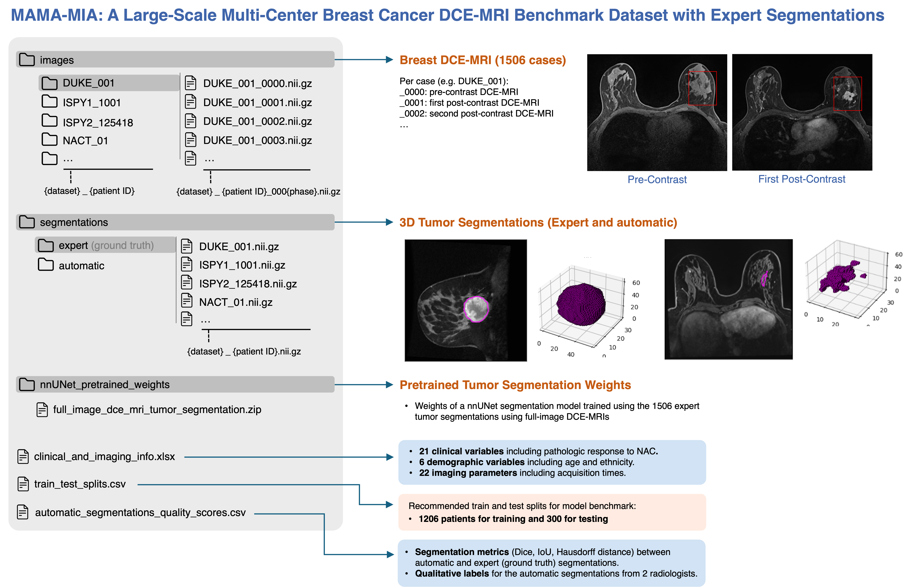
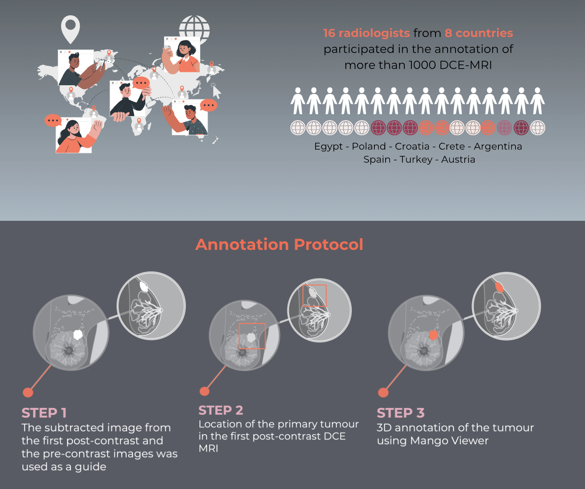
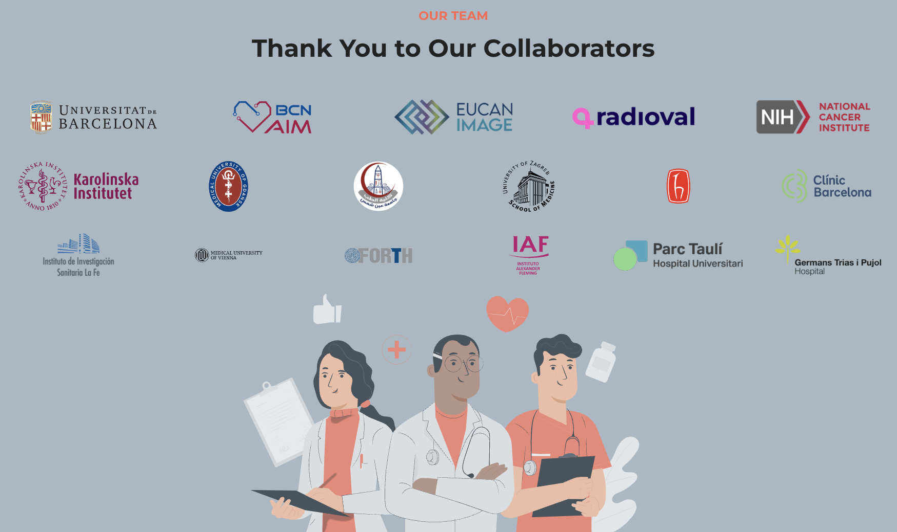

# MAMA-MIA: A large-scale multicenter breast cancer DCE-MRI benchmark dataset with expert segmentations
[](https://doi.org/10.1038/s41597-025-04707-4) [](https://doi.org/10.7303/syn60868042) [](https://creativecommons.org/licenses/by-nc/4.0/)
 
Welcome to the **MAMA-MIA** dataset repository! This dataset contains **1,506** cases of **breast cancer** dynamic contrast-enhanced magnetic resonance images (**DCE-MRI**) with **expert tumor segmentations**. Below, you will find all the necessary information to download and use the dataset, as well as instructions on how to run inference using our pre-trained nnUNet model.

If you use the MAMA-MIA dataset or the pretrained model in your research, please cite our publication and the dataset publications of the images included in the dataset.
#### BibTex:
````
@article{garrucho2025,
  title={A large-scale multicenter breast cancer DCE-MRI benchmark dataset with expert segmentations},
  author={Garrucho, Lidia and Kushibar, Kaisar and Reidel, Claire-Anne and Joshi, Smriti and Osuala, Richard and Tsirikoglou, Apostolia and Bobowicz, Maciej and Riego, Javier del and Catanese, Alessandro and Gwoździewicz, Katarzyna and Cosaka, Maria-Laura and Abo-Elhoda, Pasant M and Tantawy, Sara W and Sakrana, Shorouq S and Shawky-Abdelfatah, Norhan O and Salem, Amr Muhammad Abdo and Kozana, Androniki and Divjak, Eugen and Ivanac, Gordana and Nikiforaki, Katerina and Klontzas, Michail E and García-Dosdá, Rosa and Gulsun-Akpinar, Meltem and Lafcı, Oğuz and Mann, Ritse and Martín-Isla, Carlos and Prior, Fred and Marias, Kostas and Starmans, Martijn P A and Strand, Fredrik and Díaz, Oliver and Igual, Laura and Lekadir, Karim},
  journal = {Scientific Data},
  year = {2025},
  doi = {10.1038/s41597-025-04707-4},
  pages = {453},
  number = {1},
  volume = {12}
}
````

### Potential Applications
Some of the potential applications of the dataset are:
- Classification, Detection and Segmentation of Breast Cancer in MRI using Deep Learning.
- Radiomic extraction and Machine Learning.
- Segmentation Model Finetuning using the Pretrained nnUNet Weigths.
- Fine-tuning of Foundational Models.
- Treatment Response to Neoadjuvant Chemotherapy.
- Patient Survival Prediction.
- Segmentation Quality Control.
- Image Synthesis.


## Repository Structure
````
├── README.md                     # Project overview, setup instructions, and usage details
├── requirements.txt              # List of Python package dependencies for running the project
├── nnUNet                        # Forked nnUNet GitHub repository for training the automatic segmentation model
├── notebooks                      # Jupyter Notebooks for project demos and examples
│   ├── demo_preprocessing_pipeline.ipynb   # Demonstrates common MRI preprocessing steps (e.g., bias field correction, normalization, resampling)
│   ├── display_clinical_data.ipynb         # Example on how to parse and visualize clinical data from the dataset
│   └── display_segmentations.ipynb         # Various methods for displaying MRI images and their corresponding segmentation masks
└── src                             # Python source code used in the Jupyter Notebooks
    ├── clinical_data.py           # Functions for handling and processing clinical data
    ├── preprocessing.py           # Preprocessing functions
    └── visualization.py           # Functions for visualizing images, segmentations, and metrics
````

## Downloading the Dataset
The MAMA-MIA dataset is hosted on [Synapse](https://doi.org/10.7303/syn60868042). You can download the dataset using the CLI or Python with the following code:

Log in using a Personal Access Token (recommended):
- Create a [Personal Access Token](https://www.synapse.org/#!PersonalAccessTokens:)

##### Command Line Interface (CLI)
```bash
 synapse login --authToken <YOUR_TOKEN_HERE>
 synapse get -r syn60868042
```

##### Python

```bash
import synapseclient
syn = synapseclient.Synapse()
syn.login(authToken="YOUR_TOKEN_HERE")  # or syn.login('username', 'password')
entity = syn.get("syn60868042")
```
> Check Synapse [documentation](https://help.synapse.org/docs/Downloading-Data-Programmatically.2003796248.html) for more info. 

## Content


## Expert Segmentations


## Running Inference with nnUNet pre-trained model
The pre-trained vanilla nnUNet model has been trained using the 1506 full-image DCE-MRIs and the expert segmentations from the MAMA-MIA dataset. 

| **Full-image Tumor Segmentation** | **Dice** | **IoU** | **HD95** | **MSD**  |
|-------|---------:|--------:|---------:|---------:|
| nnUNet Fold 0|  0.7600  |  0.6512 |  39.90   |  11.89   |
| nnUNet Fold 1|  0.7617  |  0.6500 |  41.25   |  12.10   |
| nnUNet Fold 2|  0.7749  |  0.6714 |  31.12   |  8.86   |
| nnUNet Fold 3|  0.7616  |  0.6577 |  36.25   |  11.74   |
| nnUNet Fold 4|  0.7520  |  0.6396 |  38.57   |  10,81   |
| **nnUNet Mean** |  **0.7620**  |  **0.6539** |  **37.41**  |  **11.08**  |

The metrics correspond to Dice Coefficient, Intersection over Union (IoU), the 95 Percentile of Hausdorff Distance (HD95) and to the Mean Surface Distance (MSD). The distances are in mm.
The library used to compute these metrics was [seg-metrics v1.2.7](https://doi.org/10.5281/zenodo.12094185). 


##### Step 1. Clone the repository
Clone the forked repository of nnUNet.
````
git clone https://github.com/LidiaGarrucho/MAMA-MIA
cd MAMA-MIA/nnUNet
````

##### Step 2. Install the necessary dependencies
To run the pre-trained nnUNet model, follow the [installation instructions](https://github.com/LidiaGarrucho/nnUNet/blob/master/documentation/installation_instructions.md).

##### Step 3. Download the pre-trained weights
The nnUNet pretrained weights can be dowloaded from [Synapse](https://www.synapse.org/Synapse:syn61247992).
Unzip the folder inside nnUNet GitHub repository under `nnUNet/nnunetv2/nnUNet_results`.

##### Step 4. (Recommended) Preprocess your input MRI images
The recommended preprocessing steps to get optimum performance are:
- **z-score normalization**. For DCE-MRI, use the mean and standard deviation of all the phases (from pre to last post-contrast) to z-score the DCE-MRI sequence.
- **isotropic pixel spacing**. The MRIs were resampled using a uniform pixel spacing of [1,1,1].

##### Step 5. Run the nnUNet inference
````
nnUNetv2_predict -i /path/to/your/images -o /path/to/output -d 101 -c 3d_fullres
````
- Replace `/path/to/your/images` with the directory containing your input images.
- Replace `/path/to/output` with the directory where you want to save the output segmentations.

> Note: An error might arise if your images are not in compressed NifTI format (.nii.gz).

## Citation and Attribution
If you use the MAMA-MIA dataset or the pretrained model in your research, please cite our publication and the dataset publications of the images included in the dataset.

#### MAMA-MIA Dataset
> Garrucho, L., Kushibar, K., Reidel, CA. et al. A large-scale multicenter breast cancer DCE-MRI benchmark dataset with expert segmentations. Sci Data 12, 453 (2025) ([10.1038/s41597-025-04707-4](https://doi.org/10.1038/s41597-025-04707-4)).

##### BibTex:
````
@article{garrucho2025,
  title={A large-scale multicenter breast cancer DCE-MRI benchmark dataset with expert segmentations},
  author={Garrucho, Lidia and Kushibar, Kaisar and Reidel, Claire-Anne and Joshi, Smriti and Osuala, Richard and Tsirikoglou, Apostolia and Bobowicz, Maciej and Riego, Javier del and Catanese, Alessandro and Gwoździewicz, Katarzyna and Cosaka, Maria-Laura and Abo-Elhoda, Pasant M and Tantawy, Sara W and Sakrana, Shorouq S and Shawky-Abdelfatah, Norhan O and Salem, Amr Muhammad Abdo and Kozana, Androniki and Divjak, Eugen and Ivanac, Gordana and Nikiforaki, Katerina and Klontzas, Michail E and García-Dosdá, Rosa and Gulsun-Akpinar, Meltem and Lafcı, Oğuz and Mann, Ritse and Martín-Isla, Carlos and Prior, Fred and Marias, Kostas and Starmans, Martijn P A and Strand, Fredrik and Díaz, Oliver and Igual, Laura and Lekadir, Karim},
  journal = {Scientific Data},
  year = {2025},
  doi = {10.1038/s41597-025-04707-4},
  pages = {453},
  number = {1},
  volume = {12}
}
````

The MAMA-MIA dataset includes public DCE-MRI images from four different collection in the TCIA repository under the following licenses:

#### ISPY1 Trial (License [CC BY 3.0](https://creativecommons.org/licenses/by/3.0/)) 

> David Newitt, Nola Hylton, on behalf of the I-SPY 1 Network and ACRIN 6657 Trial Team. (2016). Multi-center breast DCE-MRI data and segmentations from patients in the I-SPY 1/ACRIN 6657 trials. The Cancer Imaging Archive. [https://doi.org/10.7937/K9/TCIA.2016.HdHpgJLK](https://www.cancerimagingarchive.net/collection/ispy1/)

#### Breast-MRI-NACT-Pilot (License [CC BY 3.0](https://creativecommons.org/licenses/by/3.0/)) 
> Newitt, D., & Hylton, N. (2016). Single site breast DCE-MRI data and segmentations from patients undergoing neoadjuvant chemotherapy (Version 3) [Data set]. The Cancer Imaging Archive. [https://doi.org/10.7937/K9/TCIA.2016.QHsyhJKy](https://doi.org/10.7937/K9/TCIA.2016.QHsyhJKy)

#### ISPY2 Trial (License [CC BY 4.0](https://creativecommons.org/licenses/by/4.0/)) 

> Li, W., Newitt, D. C., Gibbs, J., Wilmes, L. J., Jones, E. F., Arasu, V. A., Strand, F., Onishi, N., Nguyen, A. A.-T., Kornak, J., Joe, B. N., Price, E. R., Ojeda-Fournier, H., Eghtedari, M., Zamora, K. W., Woodard, S. A., Umphrey, H., Bernreuter, W., Nelson, M., … Hylton, N. M. (2022). I-SPY 2 Breast Dynamic Contrast Enhanced MRI Trial (ISPY2)  (Version 1) [Data set]. The Cancer Imaging Archive. [https://doi.org/10.7937/TCIA.D8Z0-9T85](https://doi.org/10.7937/TCIA.D8Z0-9T85)

#### Duke-Breast-Cancer-MRI (License [CC BY-NC 4.0](https://creativecommons.org/licenses/by-nc/4.0/))
> Saha, A., Harowicz, M. R., Grimm, L. J., Weng, J., Cain, E. H., Kim, C. E., Ghate, S. V., Walsh, R., & Mazurowski, M. A. (2021). Dynamic contrast-enhanced magnetic resonance images of breast cancer patients with tumor locations [Data set]. The Cancer Imaging Archive. [https://doi.org/10.7937/TCIA.e3sv-re93](https://doi.org/10.7937/TCIA.e3sv-re93)



Thank you for using our dataset and pretrained model! If you have any questions or issues, please feel free to open an issue in this repository.

